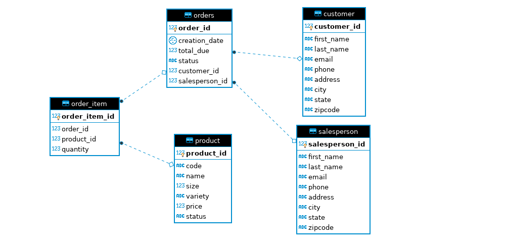

# __JDBC Application__
In this applications, we have seen the power of JDBC and how we can get data into and out of any application on any platform using relational database. JDBC is an API for client-side access to a database that allows the user to have Universal Data Access and is hot swappable. 
In my application, I have used JDBC drivers to connect to PostgreSQL and perform several queries on data as required. Data Access Object(DAO) design pattern is used to perform CRUD(create, read, update, delete) functionality. Concepts like Data Transfer Objects(DTOs), Data Access Object(DAOs), how JDBC drivers are used with Java to perform CRUD operations to manipulate data. 
[Application reference](https://www.lynda.com/Java-tutorials/Welcome-Java-Database-Connectivity-JDBC/779748/5033987-4.html?org=torontopubliclibrary.ca)

## __Entity Relation Diagram (ERD)__

## __Design Patterns__

Two design patterns used are as follows: 

### __Data Access Object (DAO) Pattern__
This pattern provides an abstraction layer between the raw JDBC code and the business logic. DAOs can come in two forms, they can be simple abstraction or it can be a true object. Multiple Data Transfer Objects (DTOs) with DAOs as a pure abstraction layer is also very popular.
DAO provides specific data operations without exposing details of the database. DAO classes access multiple databases. They are not recommended to use with distributed systems as inter database joins are not convenient. 

### __Repository Pattern__ 
Repository pattern is an abstraction of a collection of objects. Repository pattern focuses on single table access per class. In repositpry pattern, joins are performed in the code. Repository pattern allows us to shard the database in such a way that we can focus on single table access instead of accessing the entire database as a whole and so repository patterns are suitable for distributed systems. 

In this JDBC implementation, table OrderDAO is based on DAO design pattern because it accesses 5 tables. On the other hand, CustomerDAO shows repository design pattern as it accessed only Customer table. 

