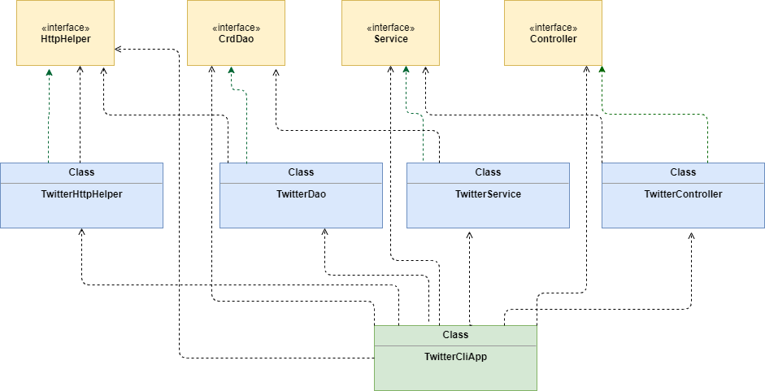

# __TwitterCLI Application__

## __Design__

### __UML Diagram__




We have used bottom-up approach for implementing this application - 
DAO > Service > Controller > AppMain

### __Class Dependency Diagram__


_TwitterCLIApp_ depends on _TwitterController_ depends on _TwitterService_ depends on _TwitterDao_ depends on _TwitterHttpHelper_.

### __Components__
* __DAO (TwitterDAO)__ - Data Access Object is a design pattern. Its classes handle data with external storage. It calls `HttpHelper` that establishes a connection between the API and application for executing HTTP after URI is constructed. URI is needed to post, delete and fetch tweets. HttpHelper, in addition, authorizes HTTP request using Oauth 1.0 protocol and twitter secrets to post, show or delete tweets.  
* __Service (TwitterService)__ - This layer deals with business logic. It took care of tweet text length that should not exceed 140 characters and Tweet ID in correct format.
* __Controller (TwitterController)__ - Controller layer consumer user arguments and calls the corresponding service layer method.
* __Application (TwitterCliApp)__ - This is where all components are declared and instantiated. It calls run method. Run method parses arguments and calls controller method. It prints tweets returned by Controller method.

## __Quick Start__

### __Packaging application using Maven__
1. Setting up environment variables which has Twitter Secrets - 
	* consumerKey
	* consumerSecret
	* accessToken
	* TokenSecret
1. Packaging project using Maven - `mvn package`
1. Run the app - `java -jar target/java_apps-1.0-SNAPSHOT.jar post|show|delete [option(s)]`

### __Running application and Options USAGE__
1. __Post a tweet__ - `twitterCLIApp post "sample text" "Longitude:Latitude"` 
1. __Show a tweet__ - `twitterCLIApp show id`
1. __Delete a tweet__ - `twitterCLIApp delete tweetId1, tweetId2, ...`

## __Tweet Model__
Tweet model is implemented with POJOs which is a class with private member variables and public getter and setters. This class encapsulates Tweet data which is often displayed in JSON format.
_Sample Json output of Tweet model_ - 

```json
{
   "created_at":"Mon Feb 18 21:24:39 +0000 2019",
   "id":1097607853932564480,
   "id_str":"1097607853932564480",
   "text":"test with loc223",
   "entities":{
	"hashtags":[],
	"user_mentions":[]
	},
   "coordinates":null,
   "retweet_count":0,
   "favorite_count":0,
   "favorited":false,
   "retweeted":false
}
```
 
In this application, we use the same Tweet model as Data Transfer Model (or DTO) and Data access model (or domain model).

To construct Tweet object, we implemented 5 classes - 
* `Coordinates.java` 
* `Entities.java`
* `Hashtag.java`
* `Tweet.java`
* `UserMention.java`

## __Improvements__
* Fetching tweets using user Twitter handle.
* Functionality like  posting tweets including pictures, videos and GIFs in addition to text tweets, can be added.
* Retweeting functionality, similar to web app and mobile app can be added.
* Viewing other users timeline using their twitter handle.

