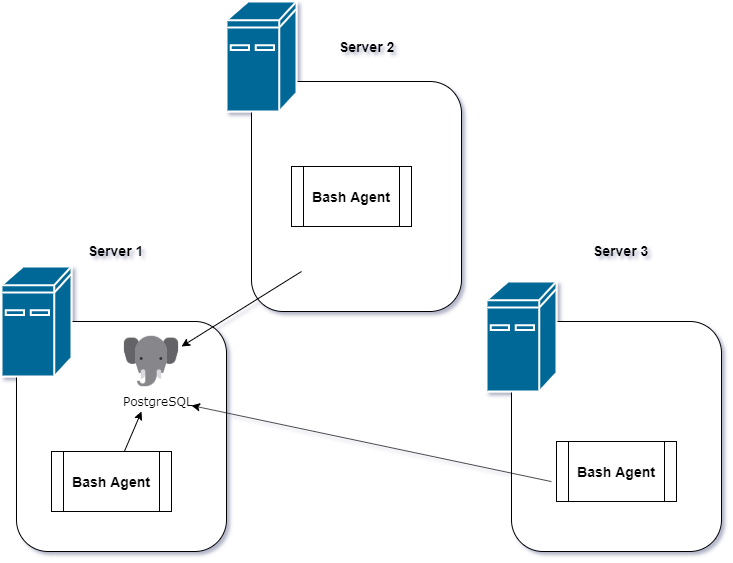

# **Architecture Diagram and Design**



**Introduction**
Cluster Monitor Agent is an internal tool that monitors the requests that monitors the cluster resources.

## _Linux Sql project structure and design_
1. *Scripts*
	* __host_info.sh__: Collects the host hardware info and insert it into the database. It will run only once at the installation time.
	* __host_usage.sh__: Collects the current host usage (CPU and Memory) and then insert into the database. It will be triggered by the _crontab_ job every minute.
	* __psq_docker.sh__

1. *SQL* 
	* __ddl.sql__: Contains creation of tables.
	* __queries.sql__: Conatins queries to manipulate data

1. *README.md* : Contains high-level and detailed description os the project.

## __USAGE__

1. Executing DDL script which creates database and two tables - *host_info* and *host_usage*
`psql -h localhost -U postgres -W -f ./linux_sql/sql/ddl.sql`

1. Execute *host_info.sh* to save the host related information with argument as mentioned below:
```
 ./scripts/host_info.sh psql_host psql_port db_name psql_user psql_password
```
1. *host_usage.sh*: 
```
./scripts/usage.sh psql_host psql_port db_name psql_user psql_password
```
1. *crontab*: run *crontab -e*. Then add:
```
* * * * * bash /home/centos/dev/jarvis_data_eng_aayushi/linux_sql/scripts/host_usage.sh "localhost" 5432 "host_agent" "postgres" "postgres" > /tmp/host_usage.log
```
save and exit.

## **Improvements**
1. Generating detailed report on applications and system health.
1. Alert generation if something is not working as expected.
1. More queries can be added to extract more information. 


