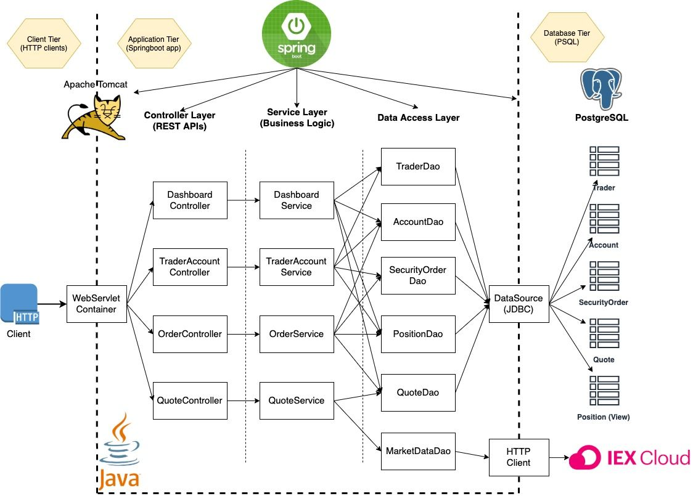
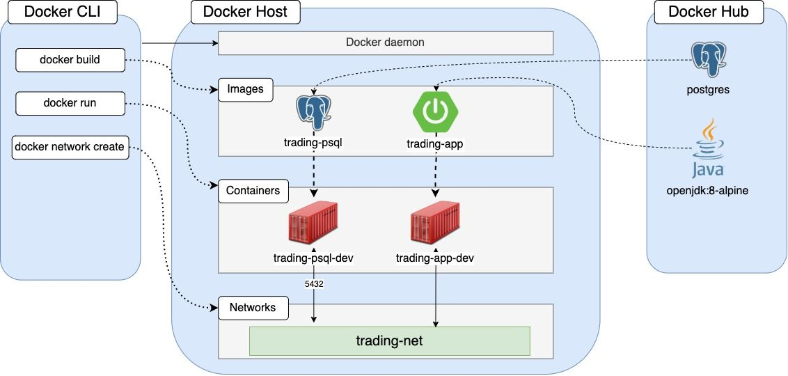

# Trading Application 


## Table of contents
* [Introduction](#introduction)
* [Quick Start](#quick-start)
* [Architecture](#architecture)
* [Rest API Usage](#rest-API-usage)
* [Docker Deployment](#docker-deployment)
* [Improvements](#improvements)


## Introduction
Trading app is an online stock trading simulation on REST API which is built using SpringBoot framework. It implements MVC and Microservice design architecture. The application pulls stock market data from IEXCloud. Models like Trader, Quote, Account and SecurityOrder are defined and their data is stored into a PSQL database. Maven is used to build the application and deployed using docker containers. Trading app can be used by anyone – developers or traders using web browser via Swagger UI.


## Quick Start
Prerequisites for deployment -
1. Machine or VM – Cento7 or higher
1. Docker version – 17.05 or higher
1. Java 8
1. Maven to build and package the application
1. API Token – IEX Cloud account 


## Setting environment variables
```
#Setting environment variables
 export IEX_PUB_TOKEN = “API token”

#Checking maven and docker versions
 mvn -v
 sudo docker -v


#Verify Docker is running
 sudo systemctl status docker || sudo systemctl start docker


#Create docker network
 sudo docker network create –driver bridge trading-net


#Verify docker network
 sudo docker network ls


#Create database image – trading-psql
 cd ./springboot/psql
 sudo docker build t tradingpsql


#Verify database image creation
 sudo docker image ls -f reference=tradingpsql

#Create application image – trading-app
 cd ./springboot/
 sudo docker build -t trading-app


#Verify trading-app creation
 sudo docker image ls -f reference=tradingapp


#Start database container 
 sudo docker run --name trading-psql-dev \ 
 -e POSTGRES_PASSWORD=password \ 
 -e POSTGRES_DB=jrvstrading \ 
 -e POSTGRES_USER=postgres \ 
 --network trading-net \ 
 -d -p 5432:5432 trading-psql


#Start trading application
 sudo docker run --name trading-app-dev \ 
 -e "PSQL_URL=jdbc:postgresql://trading-psql-dev:5432/jrvstrading" \ 
 -e "PSQL_USER=postgres" \ 
 -e "PSQL_PASSWORD=password" \ 
 -e "IEX_PUB_TOKEN=${IEX_PUB_TOKEN}" \ 
 --network trading-net \ 
 -p 5000:5000 -t trading-app

#Verify database container and app container are running
 sudo docker container ls
```

## Architecture
Component diagram:




***DAO Layer*** – Responsible for data exchange with database and IEX cloud. This layer is in the application tier that has Controller, service and DAO layers.

***Service Layer*** – This layer handles the business logic. It makes sure trader id is not null, etc. If all the checks are passed, it makes calls to DAO layer. 

***Controller Layer*** – This layer takes user input and handles HTTP requests.
It makes calls to Sevice layer.

***SpringBoot*** – Framework helps to manage dependencies and a web servlet TomCat used to deploy the application

***Data Layer*** – Consist of Psql and IEX cloud. It stores the data used by application.


## Rest API Usage
***Swagger*** :  Swagger is an API description format for REST API. It is a set of open source tools that helps in designing, building, documenting and consuming REST APIs. Alternatively POSTMAN can be used to make HTTP calls.

***Quote Controller*** : Quote controller deals with the retrieval and modification of quote table data and stock market data from IEX cloud.
Quote Controller handles the following:
1. GET `/quote/dailyList` :  Show the dailyList. Show all tickers that are available to be traded on this platform.
1. GET `/quote/iex/ticker/{ticker}` :  Show iexQuote. Retrieve  quote from IEX for a specified ticker. If the ticker is invalid it returns 400 response. 
1. POST `/quote/tickerId/{tickerId}` :  Add a new ticker to the dailyList. Finds a ticker that does not exist in the dailyList. Add new ticker using endpoint. Verify with `Show the dailyList` endpoint.
1. PUT `/quote/` : Update a given quote in the quote table.
1. PUT `/quote/iexMarketData` : Update quote table using IEX data. Fetches quotes from IEX and update all quotes from the quote table.

***Trader Account Controller*** : Handles requests that manages trader and account information. It helps in creation of new accounts, depositing and withdrawal of funds and deletion of accounts. 
Trader Account Controller handles the following endpoints:
1. POST `trader/*` : Create a new trader. Id must be null. An account is also created with the same id generated for trader. 
There are two endpoints that can create a new trader. The first will allow you to create new trader using HTTP request body, and the other one allows you to use URL. 
1. PUT `/trader/deposit/*` :  Deposit fund. Deposits money in the account of specified trader id. Returns error if amount is less than 1 or traderId is invalid.
1. PUT `/trader/withdraw/*` : Withdraw fund.  Withdraws amount from specified traderIDs account. Returns error if traderID is invalid or insufficient funds in the account.
1. DELETE `/trader/traderId/{traderId}` : Delete a trader. It can only be deleted when there are no funds in the account and trader has no open positions.

***Order Controller*** : It handles requests for buying and selling. Both buying and selling requests are handled by the following end point: 
1. POST `/order/marketOrder` : Executes a new buy or sell order with mentioned accountId, ticker and size. Size determines whether the order is buy or sell. If size is positive, it is a buy order and if it is negative it is a sell order.

***Dashboard Controller*** : Handles the requests that deals with viewing and returning trader information. Dashboard Controller handles following endpoints:
1. GET `/dashboard/portfolio/traderId/{traderId}` : Show portfolio by trader ID. Returns trading portflio of the trader of specified traderID. Returns error if trader id is invalid or does not exist.
1. GET `/dashboard/profile/traderId/{traderId}` : Show trader profile by trader ID. Returns trader profile and trader account of specified traderID.


## Docker Deployment
Working of Docker deployment: 



Docker manages application deployment.
Docker daemon builds docker images  Two images are built in this case using docker build.
Trading-psql and trading-app images are build by pulling postgres image and alpine image from the docker hub. 
Two docker files are created, one for the database and other for the app. All the details regarding database is stored in database docker file.

Information on how to build the app using maven is stored in app dockerfile.
At last, two containers are created for trading-psql and trading-app images and are connected to trading-net network so communication can be established between the two.


## Improvements
1. Traders might have multiple accounts registered under same traderId but different accountId.
1. Authenticating traders to avoid necessary losses. 
1. Alerting the user about market gap and price difference during that time when a user places an order after market is closed.
1. Analytical features like pattern recognition predicting the future price level can be included.
1. Limit order should be allowed where boundaries on paying and accepting are specified.
